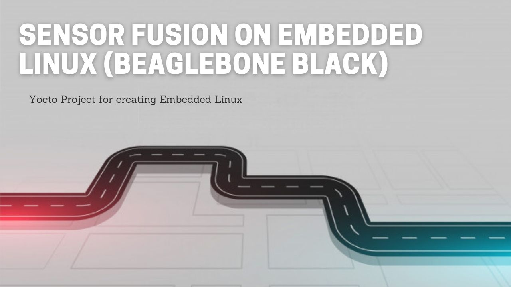

## Sensor Fusion on Embedded Linux (BeagleBone Black)
### Projects
~~~
1. Estimating Passive Suspension with Kalman Filter
2. Localization with Extended Kalman Filter
3. Localization with Particle Filter
~~~

### Tools & Libraries
~~~
IDE :  Qt Creator
Compiler :  GNU GCC & GNU G++
Programming Language : 	C++ 17
Library : Eigen3
Library : C++ Stats
Library : GoogleTest & GoogleMock
Build Tool : CMake
~~~

### Demonstration Video on Youtube (click the image to show the Video on Youtube)

### References
~~~
1. H∞ control of active vehicle suspensions with actuator time delay, 
	Haiping Du, Nong Zhang, 2007
2. Output-Feedback-Based H∞ Control for Vehicle Suspension Systems 
	With Control Delay, Hongyi Li, Xingjian Jing, and Hamid Reza Karimi, 2014
~~~